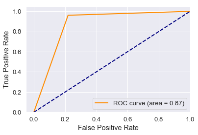

```python
#Allows charts to appear in the notebook
%matplotlib inline

#libraries for analysis
import pandas as pd
import numpy as np
from sklearn.model_selection import train_test_split
# from sklearn.linear_model import LogisticRegression
# classifier = LogisticRegression()
from sklearn.pipeline import make_pipeline
from sklearn.preprocessing import StandardScaler, normalize
from sklearn.ensemble import RandomForestClassifier
rf = RandomForestClassifier(n_estimators=200,n_jobs=-1)

#libraries for visualization
import matplotlib.pyplot as plt
import seaborn as sns; sns.set(font_scale=1.2)
```


```python
#Read data from spreadsheet
df = pd.read_csv("2017_LoanData - Copy - Cat.csv", header=0, index_col=None)
df.head()
```


<div>
<style scoped>
    .dataframe tbody tr th:only-of-type {
        vertical-align: middle;
    }

    .dataframe tbody tr th {
        vertical-align: top;
    }

    .dataframe thead th {
        text-align: right;
    }
</style>
<table border="1" class="dataframe">
  <thead>
    <tr style="text-align: right;">
      <th></th>
      <th>grade</th>
      <th>Years_At_Present_Employment</th>
      <th>Housing</th>
      <th>loan_status</th>
      <th>dti</th>
      <th>Delinquency</th>
      <th>Collections</th>
      <th>Derogatory</th>
    </tr>
  </thead>
  <tbody>
    <tr>
      <th>0</th>
      <td>2</td>
      <td>10</td>
      <td>MORTGAGE</td>
      <td>Current</td>
      <td>11.52</td>
      <td>1</td>
      <td>0</td>
      <td>0</td>
    </tr>
    <tr>
      <th>1</th>
      <td>2</td>
      <td>4</td>
      <td>RENT</td>
      <td>Current</td>
      <td>13.43</td>
      <td>0</td>
      <td>0</td>
      <td>0</td>
    </tr>
    <tr>
      <th>2</th>
      <td>3</td>
      <td>10</td>
      <td>MORTGAGE</td>
      <td>Current</td>
      <td>31.07</td>
      <td>0</td>
      <td>0</td>
      <td>0</td>
    </tr>
    <tr>
      <th>3</th>
      <td>5</td>
      <td>10</td>
      <td>MORTGAGE</td>
      <td>Current</td>
      <td>6.06</td>
      <td>0</td>
      <td>0</td>
      <td>0</td>
    </tr>
    <tr>
      <th>4</th>
      <td>3</td>
      <td>4</td>
      <td>OWN</td>
      <td>Current</td>
      <td>17.48</td>
      <td>0</td>
      <td>0</td>
      <td>0</td>
    </tr>
  </tbody>
</table>
</div>


```python
# change the categorical data to binary
df_X = df.drop("loan_status", axis=1)
df_X = pd.get_dummies(df_X)
df_X.head()
```


<div>
<style scoped>
    .dataframe tbody tr th:only-of-type {
        vertical-align: middle;
    }

    .dataframe tbody tr th {
        vertical-align: top;
    }

    .dataframe thead th {
        text-align: right;
    }
</style>
<table border="1" class="dataframe">
  <thead>
    <tr style="text-align: right;">
      <th></th>
      <th>grade</th>
      <th>Years_At_Present_Employment</th>
      <th>dti</th>
      <th>Delinquency</th>
      <th>Collections</th>
      <th>Derogatory</th>
      <th>Housing_MORTGAGE</th>
      <th>Housing_OWN</th>
      <th>Housing_RENT</th>
    </tr>
  </thead>
  <tbody>
    <tr>
      <th>0</th>
      <td>2</td>
      <td>10</td>
      <td>11.52</td>
      <td>1</td>
      <td>0</td>
      <td>0</td>
      <td>1</td>
      <td>0</td>
      <td>0</td>
    </tr>
    <tr>
      <th>1</th>
      <td>2</td>
      <td>4</td>
      <td>13.43</td>
      <td>0</td>
      <td>0</td>
      <td>0</td>
      <td>0</td>
      <td>0</td>
      <td>1</td>
    </tr>
    <tr>
      <th>2</th>
      <td>3</td>
      <td>10</td>
      <td>31.07</td>
      <td>0</td>
      <td>0</td>
      <td>0</td>
      <td>1</td>
      <td>0</td>
      <td>0</td>
    </tr>
    <tr>
      <th>3</th>
      <td>5</td>
      <td>10</td>
      <td>6.06</td>
      <td>0</td>
      <td>0</td>
      <td>0</td>
      <td>1</td>
      <td>0</td>
      <td>0</td>
    </tr>
    <tr>
      <th>4</th>
      <td>3</td>
      <td>4</td>
      <td>17.48</td>
      <td>0</td>
      <td>0</td>
      <td>0</td>
      <td>0</td>
      <td>1</td>
      <td>0</td>
    </tr>
  </tbody>
</table>
</div>


```python
# sorting y or to be predicted labels
df_y = df["loan_status"]
df_y = pd.get_dummies(df_y)
current_labels = df_y["Current"].values
print(current_labels)
```

    [1 1 1 ... 1 1 1]
    


```python
# checking the default values in the dataset to ensure that ML model predicts more than just the random pick
nd,d = df["loan_status"].value_counts()
print(f'{d}, {nd}, {nd/(d+nd)*100}%')
```

    77337, 365843, 82.54952840832168%
    


```python
# define X and y
X = df_X.values
y = current_labels
```


```python
# split the data to train and test
from sklearn.model_selection import train_test_split

X_train, X_test, y_train, y_test = train_test_split(X, y, random_state=1, stratify=y)
```


```python
# normalize the input data
# X_tr_scaler = normalize(X_train, axis=1)
# X_tst_scaler = normalize(X_test, axis=1)

```


```python
# %%time
# # create and fit a logistic regression model
# from sklearn.metrics import accuracy_score
# pipeline_model = make_pipeline(StandardScaler(), classifier)
# pipeline_model.fit(X_train, y_train)
```


```python
%%time
# create and fit a random forest model
from sklearn.metrics import accuracy_score
pipeline_model = make_pipeline(StandardScaler(), rf)
pipeline_model.fit(X_train, y_train)
```

    Wall time: 32 s
    


```python
# print(f"Training Data Score: {classifier.score(X_train, y_train)}")
# print(f"Testing Data Score: {classifier.score(X_test, y_test)}")
```


```python
predictions_tr = pipeline_model.predict(X_train)
print(accuracy_score(predictions_tr, y_train))
```

    0.9897438211712322
    


```python
predictions = pipeline_model.predict(X_test)
print(accuracy_score(predictions, y_test))
```

    0.92957263414414
    


```python
# calculate feature importance, less important features may be ignored
importances = rf.feature_importances_
sorted(zip(rf.feature_importances_, df_X.columns), reverse=True)
```


    [(0.27698068615351856, 'dti'),
     (0.24474033858965352, 'grade'),
     (0.21452670169628163, 'Derogatory'),
     (0.14111996504136343, 'Collections'),
     (0.10758993890885156, 'Delinquency'),
     (0.012678749187204347, 'Years_At_Present_Employment'),
     (0.0010194640033150163, 'Housing_MORTGAGE'),
     (0.0009475206369238366, 'Housing_RENT'),
     (0.0003966357828879942, 'Housing_OWN')]


```python
print(df_X.columns.tolist())
print(X_train[0])
```

    ['grade', 'Years_At_Present_Employment', 'dti', 'Delinquency', 'Collections', 'Derogatory', 'Housing_MORTGAGE', 'Housing_OWN', 'Housing_RENT']
    [ 1.   10.   15.44  0.    0.    0.    1.    0.    0.  ]
    


```python
yy = [[ 1.  , 10.  , 80,  0.  ,  0.  ,  1.  ,  1.  ,  0.  ,  0.  ]]
print(pipeline_model.predict(yy))
```

    [1]
    


```python
# plot roc curve and calculate area under the curve
from sklearn.metrics import roc_curve, auc
# y_score = pipeline_model.fit(X_train, y_train).decision_function(X_test) #for LR and SVM
y_score = pipeline_model.fit(X_train, y_train).predict(X_test) #for RF
fpr, tpr, _ = roc_curve(y_test, y_score)
# fpr, tpr = roc_curve(y_test, y_score[0])
roc_auc = auc(fpr,tpr)
```


```python
# plot fpr and tpr values
plt.figure()
lw = 2
plt.plot(fpr, tpr, color='darkorange',
         lw=lw, label='ROC curve (area = %0.2f)' % roc_auc)
plt.plot([0, 1], [0, 1], color='navy', lw=lw, linestyle='--')
plt.xlim([-0.05, 1.0])
plt.ylim([0.0, 1.05])
plt.xlabel('False Positive Rate')
plt.ylabel('True Positive Rate')
plt.legend(loc="lower right")
plt.show()
```





Good value of area under roc curve proves that the model is doing a decent job of prediction
