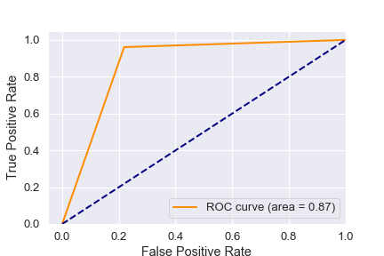

Machine learning models were applied for prediction of loan application quality. The dataset used for ml modeling initially contained many features (around 57), which were trimmed down to 7, based on weightage. Few ml models were applied to figure out the best model for this problem.
* Neural network (deep learning) - The accuracy was almost as good as random pick
* KNN (K nearest neighbours) - accuracy increased with as K value increased up. Discarded as the accuracy was as good as randomly picking, whether loan will default or not.
* SVC (Support vector classifier) - took too long a time to run and optimize coefficients, and accuracy not good enough
* Logistic Regression - almost 93% test accuracy, fast processing
* Random Forest (rf) - 93% test accuracy, used features_importance method to trim features to only the most important ones.

##### ROC Curve
ROC curve was calculated for the rf model, and was found that the area under the curve = 0.87

This shows that rf model was doing a decent job of prediction of loan quality on test data.
